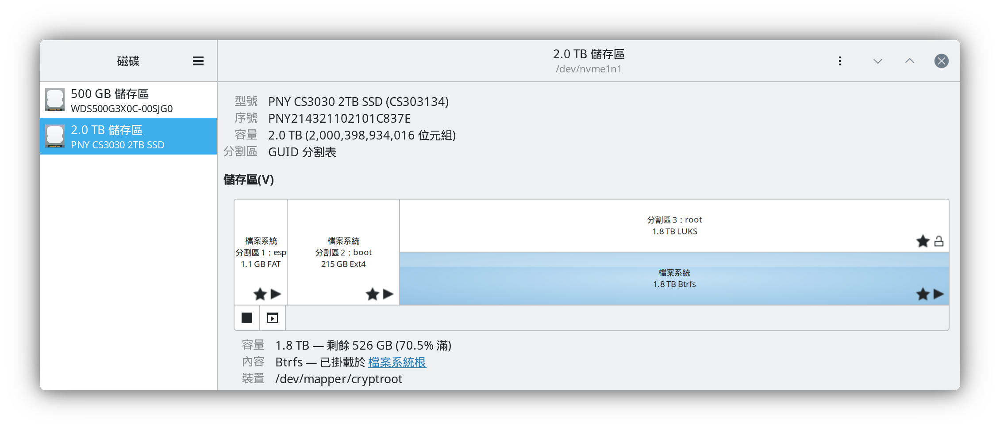
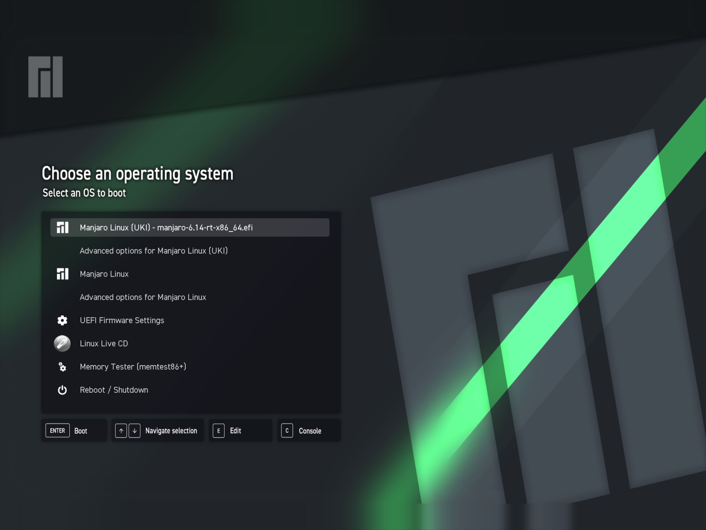

<!-- _paginate: skip -->

# 現代化開機與資料安全的Linux作業系統環境

LUKS2 + TPM + UKI .efi + SecureBoot

以下都以Manjaro Linux (Arch Linux)為主


Yuan Chiu <chyuaner@gmail.com>

---

# 需求

我平常會隨時帶筆電外出，而且筆電硬碟裡面有放敏感資料（個人證件、公司機密...等等）

* 平常在作業系統設置登入認證（傳統密碼、指紋、人臉辨識...）
* 防止利用Live CD開機，繞過原先在主作業系統設置的登入認證，直接存取硬碟
* 也要防止硬碟被拔除，接上其他台電腦就能直接存取硬碟

---

# 這個需求，將會用到
硬碟加密+綁定這台電腦開機

* LUKS: 全分割區加密
* TPM: 為了與LUKS綁定做自動解鎖
* UKI .efi: 製作.efi直接開機啟動檔，從根本上鎖死cmdline開機參數帶入
* SecureBoot: 產生UKI時就順便簽名上SecureBoot

---

# 先說這並不是什麼新穎的東西...

* Apple電腦: T2安全晶片(or M處理器整合) + FileVault
* Windows電腦: TPM + Bitlocker

而且條件達成就會**預設啟用**

反觀Linux......
太自由導致規格太亂，很少有Linux發行版願意好好處理 (Manjaro正常安裝流程只處理到LUKS1)
> 先問問有多少教學文都是叫你關SecureBoot就沒事了...😅
---

## 解密金鑰遺失風險

* Apple電腦：反正主硬碟直接焊死在主機板不能更換，幾乎不會有和存有金鑰的晶片分開的情況。
* Windows電腦: 預設啟用條件包含**要登入Microsoft帳號**，而且Win11正常安裝流程就幾乎強制要求使用者登入。然後安裝完成就會自動上傳解密金鑰到Microsoft線上帳號。所以金鑰遺失還能從Microsoft線上帳號補救。

Linux... 都手動處理了，請自己好好保管好，保險一點就多設第二、第三種解鎖途徑。

**絕對絕對！！！不要拿TPM當作解鎖的唯一途徑！！！**
（每升級動到Linux核心、或BIOS升級，都有可能讓TPM自動解鎖失效）

---

# 先說：TPM 和 SecureBoot 是兩回事！！

* TPM (Trusted Platform Module): 必定跟著**這台**電腦，私鑰在TPM裡面沒有任何方法可以直接匯出、拿走，可以和硬碟加密綁定，確認只有這台電腦可以解鎖。
* SecureBoot: 只允許有正確簽名的作業系統才能啟動，不然會直接被主機板拒絕啟動。
    * 雖然我還是覺得很廢，只是大幅添增麻煩，隨便拿有SecureBoot的Live CD就可以用了。不過就因為這個麻煩，所以...有開還是會安全很多。

從需求面來講，一開始只會先花力氣處理TPM，最後在補流程漏洞的時候，才**順便**的把SecureBoot處理好

---

# 兩層密碼認證

開機流程：
    BIOS → GRUB → 載入Linux過程**詢問LUKS解鎖密碼** → 進入作業系統**詢問登入密碼** → 進入桌面環境！！

* LUKS 直接對硬碟重要分割區加密
    * 開機即要求輸入解鎖密碼
    * 直接從根本上防止Live CD直接存取
    * 防止硬碟改接到別台電腦上能直接存取
* 作業系統登入認證
    * LUKS成功解鎖開機以後，就不再有LUKS的防護了，後續還有暫時離開用的「鎖定畫面」、要更動到系統而需要root...等。
    * 可綁定方便認證的指紋、人臉辨識

---
<!-- _class: lead -->

## 但是...我不想每次開機都要輸入兩次密碼...

---

## 對策

* TPM綁定LUKS，開機時確認是**這台電腦**就自動解鎖！通過認證！
* 開機後再由作業系統來做使用者認證

就使用體感來說：只需輸入一次密碼，還可以彈性用方便的指紋/人臉認證，又能兼顧資料安全！

---

# LUKS硬碟分割區加密
* 要用TPM綁定，只能用LUKS2
* 但GRUB只完整支援到LUKS1...

* 對策: 
    * 分割不加密的 /boot (ext4) 分割區來放GRUB與Linux核心
    * 開機時載入含LUKS解鎖功能的Linux核心之後，由Linux核心啟動程序來解鎖真正主要的LUKS2分割區
    * 但是還是有破解漏洞... 後面會詳述


---

# LUKS1方案我也長期用過

Manjaro Linux正常安裝流程中，有開啟硬碟加密選項，那安裝程式就會用LUKS1的方式處理。

* LUKS1啟動方式：
    ```
    BIOS → 載入GRUB過程中詢問LUKS解鎖密碼 → 進入GRUB選單 → 載入Linux核心 → 進入作業系統
    ```
    (但無法綁定TPM自動解鎖，每次開機都得輸入兩次密碼。我那時筆電鍵盤還有點壞，造成密碼輸入很難過😭)

* 至於本次採用的LUKS2方式，會變成：
    ```
    BIOS → 無加密進入GRUB選單 → 載入Linux核心過程中詢問LUKS密碼 → 進入作業系統
    ```

---

# LUKS2方案 硬碟分割區加密規劃



---

# TPM Trusted Platform Module
需求上的主要目的：確認就是這一台電腦！！

* 私鑰在TPM晶片內無法匯出，無法被偽造
* 可以設定PCR來決定嚴格程度

* 現代電腦應該都有TPM晶片


--- 

## TPM PCR
* PCR 7: 只會檢查SecureBoot開關，已實測若在Live CD環境下，也會因為符合此條件而造成自動解鎖
    PS. 也呼應前面我所說的，SecureBoot其實有夠廢😂

* PCR 4+5+7 （我現在在用的）
    * PCR 4: 檢查當前作業系統核心環境
    * PCR 5: GPT硬碟分割表有無被更動
    * PCR 7: 是否有更動SecureBoot開啟開關

---

# 將目前環境綁定到LUKS

```
sudo systemd-cryptenroll /dev/nvme1n1p3 --wipe-slot=tpm2 --tpm2-device=auto --tpm2-pcrs=4+5+7
```

* 查看目前LUKS的認證途徑
    ```
    sudo systemd-cryptenroll /dev/nvme1n1p3 
    ```

* 以原生luks的查詢指令
    ```
    sudo cryptsetup luksDump /dev/nvme1n1p3 
    ```

---

# 這樣就安全了嗎？你有沒有想到可以下開機參數繞過？
然後又因為TPM環境條件成立而觸發LUKS自動解鎖
    等於 LUKS認證 + 作業系統登入認證都被繞過了...

---

# 可以透過cmdline開機參數繞過的方式
* 進入單人模式（一堆忘記root密碼的教學文章都是用這個解法）
    * 但是可以透過改 `/etc/systemd/system.conf` or `rescue.service` or `/etc/shadow` 等設定檔的方式 ，來強制要求進入單人模式也要先通過root密碼認證
* 利用 `init=/bin/bash` 繞過任何程序，直接進入shell
    * 💣 **完全無解！** 完全沒有中間環節可以強制加入登入認證。

➡️ 所以只能用鎖死cmdline的方式來處理
> 至於你可能會想問：鎖死cmdline後，若系統壞掉臨時需要下cmdline臨時開機的話不就...？ 後面會詳述

---

## 你可能會想到鎖死cmdline的解法...

針對更前面的環節：
* GRUB鎖上？
    * 你要多記GRUB密碼，而且因為GRUB是安裝在未加密 /boot 分割區，可以透過Live CD直接修改 /boot 內容修改 grub.cfg來強行加入惡意參數。
* BIOS鎖上？
    * 一樣你得多記BIOS密碼，而且硬碟拔到別台電腦就可以直接修改未加密 /boot 分割區內容，又會回到上面的問題。
* 那連同GRUB也一起加密...? 恩，前面有說GRUB還不支援LUKS2，LUKS1又不能綁TPM。

---

# UKI Unified kernel image

UKI會將 Linux initramfs + vmlinuz + ucode整個打包，合併成一個 .efi 映像檔

* 不需經過GRUB這類的開機起動器引導，直接由BIOS就直接啟動Linux作業系統
    * 不過如果喜歡GRUB的話，還是可以由GRUB引導
    * 但僅是理論，是因為若要啟用SecureBoot，情況又會不同，後述。
* 從根本上直接把cmdline鎖死，不接受任何外來開機參數
* 打包後還可以綁定加上簽章，進一步的支援SecureBoot開機！！
    * 這就是我說，我本來沒有想要處理SecureBoot，但到了這一步就想說都已經這麼順便了，就來順便處理吧～

---

# 關於SecureBoot...

順便讓我抱怨一下，SecureBoot真的是個很廢的東西...

* SecureBoot真的非常難搞，而且花了一整天or以上的力氣處理好，換來的效益就只是多了看到 `Secure Boot: enabled (deployed)` 字樣，好爽 好棒棒🫠
* SecureBoot只能擋住不正常的作業系統被載入。但是作業系統載入後就不關SecureBoot的事了。在作業系統內遇到惡意軟體，該中的毒還是會中。
* SecureBoot不會保護你的資料安全，拿有SecureBoot簽名的Live CD開機，若你原本就沒有把硬碟鎖好，該被亂搞的還是會被搞。

---

# 產出UKI前要做的事

* 開機參數要先設定好在 `/etc/kernel/cmdline`  （因為UKI .efi啟動不再依賴GRUB等外來開機參數，而且會直接鎖死）
    * 可直接把GRUB的`GRUB_CMDLINE_LINUX_DEFAULT`抄過來
    * 有上LUKS加密的話，不能依賴 `/etc/crypttab` ，一定要把完整的加密掛載資訊全寫進 `/etc/kernel/cmdline` 裡（我在這個坑踩非常久🥲）

---

# 產出 .efi 的方式：
* 自行手動下命令產出
* 掛上mkinitcpio/dracut hook，在日後安裝/升級Linux核心的時候，就自動產出對應的UKI
* 產出 .efi 後，再來看你要不要順便在.efi加上簽名，這樣就可以啟用SecureBoot。


---

# Linux要啟用SecureBoot的方式有兩種

<div class="columns">
<div>

## 透過shim層
* 對BIOS來說，是對shim啟動，然後由shim去啟動GRUB
* shim層自帶Microsoft簽名，可直接用於多數主機板，不需要額外更改BIOS設定
<!-- * 由shim軟體來管理你的簽名憑證，要在shim MOK Manager界面把你的簽名加入。 -->

</div>

<div>

## 不經過中介層，由BIOS直接啟動
* 需要自行進BIOS設定，然後把你的簽名匯入進BIOS白名單
* 前提是：BIOS設定必須要有選項可以讓你自行匯入簽名

</div>

---

# 在 .efi 與 initramfs 檔案上加入簽名，啟用SecureBoot
1. 建立MOK簽章（以 `openssl req -newkey ...` 的方式）
2. 使用 sbsign 為你的 .efi 與 initramfs加入簽名
    * `sbsign --key /usr/share/secureboot/keys/MOK.key --cert /usr/share/secureboot/keys/MOK.crt --output <來源.efi路徑> <產出.efi路徑>`
    * 也可以在手動ukify產UKI .efi的時候就直接指定你的簽章
3. 進入shim MOK Manger / BIOS SecureBoot設定，把你的簽章匯入
4. 在BIOS設定把SecureBoot Enable，測試
5. 掛上mkinitcpio/dracut hook，在日後安裝/升級Linux核心並產完UKI .efi後，自動把簽名加上去

---

# UKI 製作完成後

## 加入至BIOS開機選單，由BIOS直接開機

```
sudo efibootmgr --unicode --disk /dev/nvme1n1p1 --part 1 --create --label "Manjaro-6.12" --loader /EFI/Linux/manjaro-6.12-x86_64.efi 
```

## 加入至GRUB開機選單
* 手動編輯 `/etc/grub.d/40_custom` 檔案，加入選單，以chainloader的方式啟動 .efi 檔案開機
```
menuentry "Manjaro Linux (UKI linux-6.12.28-1)" --class manjaro {
    insmod fat
    insmod chain
    search --no-floppy --set=root --fs-uuid 11E4-A147
    chainloader /EFI/Linux/linux-6.12.28-1-MANJARO-bdf473ff6a384cf7b761270259c00933-rolling.efi
}
```

---
<!-- _backgroundImage: url(Screenshot_20250602_041116_結果.png) -->
<!-- backgroundSize: contain -->
<!-- backgroundPosition: 220% 0% -->
<!-- _class: marpit-advanced-background-split -->

<div class="columns">
<div>

# UKI 製作完成後
## 自動加入至GRUB開機選單
<!--  -->

可以[使用我調好的腳本](https://github.com/chyuaner/grub.d-custom)，
這個腳本的項目設計，是盡量比照傳統的風格 預設項目+Advanvced options子選單，並以版號順序排序。

</div>

---
# UKI 製作完成後
## 自動加入至GRUB開機選單
使用方式：將`09_uki`複製到 `/etc/grub.d/` 裡面，
之後在update-grub的時候就會自動搜尋 `/boot/efi/EFI/Linux` 裡面的所有 .efi 檔。

不過因為我的需求只有Manjaro，名稱的部份是直接寫死的，請自行依需求修改。如果有人可以再優化，歡迎PR給我！！

要注意！update-grub執行順序必須是在掛上mkinitcpio/dracut產完.efi檔之後！不然會因為抓不到.efi檔案而沒編入進選單。

---

# 改以UKI模式為預設開機以後，那傳統initramfs模式要？
UKI .efi 基本上就是把cmdline完全封死！不接受任何外來開機參數！

* 最安全最直接的辦法，就是直接把 `/etc/grub.d/10_linux` 停用掉，把 /boot/ 裡面和 initramfs, vmlinuz等相關檔案都刪掉，完全只由 .efi 檔案開機。但這樣就封死fallback — 系統壞掉時能臨時處理的路了。
* 或是多製作fallback專用的UKI .efi（不過依然不能由GRUB下cmdline，我覺得面對一堆千奇百怪的狀況，修復用途還不能自訂cmdline就沒有實質意義）

---

# 改以UKI模式為預設開機以後，那傳統initramfs模式要？
## 我的做法是：
* UKI模式 與 傳統initramfs模式並存！！
* 對TPM PCR來說，這兩個是不同的環境。（前提是PCR規則不要只用PCR=7）
* 可以把cmdline鎖死的**UKI模式，拿來與TPM+LUKS綁定用來開機自動解鎖**。
* 若系統故障需要臨時下cmdline處理的話，就使用傳統initramfs模式。反正在傳統模式下，就算以開機參數強行繞過作業系統認證這層，但因為此模式不在TPM PCR接受的環境下，必定會先觸發LUKS的詢問解鎖傳統密碼擋下。

---

# 再來就是... 實做方式

---

# 處理前的狀況

* 已拿整顆硬碟，以正常安裝流程安裝Manjaro Linux
* 當初只有三個**未加密**分割區: EFI ESP, BTRFS,SWAP

🎯 目標：盡量在最小改動、不重灌乾淨系統的情況下，全部做到前面所說的LUKS2 + TPM + UKI .efi + SecureBoot

---

# 目標

1. 希望整台 Manjaro 電腦都加密（使用 LUKS）
2. 開機時使用 TPM 無密碼解鎖
3. 進入作業系統後以指紋登入，避免敲鍵盤
4. 即使 TPM 綁定無法解鎖，也希望能有備援解法（密碼/FIDO）
5. 不想重灌，想透過備份方式導入加密

---

# 準備隨身硬碟，把全系統倒出來

* 我以往都是用Clonezilla做全硬碟映像檔備份，但...
* 本次需求需要製作LUKS分割區，LUKS**需要額外空間**存放加密資訊與認證資訊，造成主分割區勢必要縮小
    * Clonezilla原則上只能還原到比原先容量更大的分割區

---

# 我的硬碟分割表設計
<div class="columns">
<div>
處理前

* ESP
* BTRFS
    * @
    * @home
* SWAP
</div>

<div>
處理後

* ESP
* /boot
* LUKS2
    * BTRFS
        * @
        * @home
        * @swap
</div>
<div>

---

# 然後再把資料倒回來

1. 主硬碟完全清空格式化（清空方式直接用nvme reset，順便恢復SSD壽命）
    * 進Parted Magic Live CD，裡面有工具可以nvme reset
    * 進BIOS設定，由BIOS直接對SSD做nvme reset
2. 重新分割硬碟，

---

# /boot 與 / 現在共用 Btrfs，是否能在不重灌的情況下分離？
1. **準備一個獨立分割區**，格式化成 `ext4` 給 `/boot` 用（例如 `/dev/sda1`）。
2. 在 Live CD 裡掛載原本的 `/`（Btrfs）與新的 `/boot`（ext4）。
3. **搬移原本的 `/boot` 目錄內容**到新的 `/boot` 分割：
    
    ```bash
    mount /dev/sdXY /mnt/boot
    mount /dev/your-btrfs /mnt
    cp -a /mnt/boot/* /mnt/boot_new/
    ```
    
4. **修改 `/etc/fstab` 加上新的 `/boot` 掛載點**
5. `chroot` 進入系統後，重新安裝 GRUB 到 EFI（或 MBR）並更新 bootloader：
    
    ```bash
    grub-install --target=x86_64-efi --efi-directory=/boot/efi --bootloader-id=Manjaro
    update-grub
    ```

> ⚠️ GRUB 必須能存取未加密的 /boot，否則無法載入 Kernel 與 initramfs。

---

# 其他 Linux Distro 的情況

以下都是「聽說」
* Fedora
* Debian